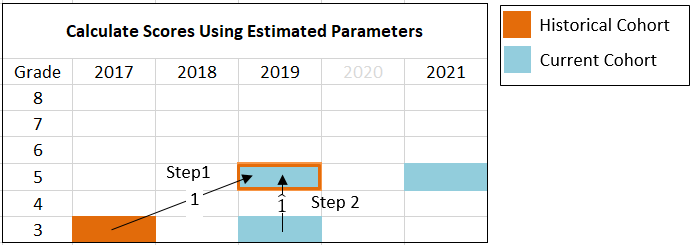
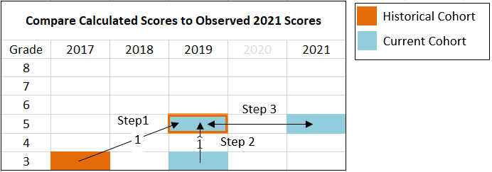

```{r setup, include=FALSE}
knitr::opts_chunk$set(echo = TRUE)
```

# Introduction

Typically, statewide summative assessment scores are reported according to rules developed to protect student privacy and support a given state's accountability system. With the flexibility offered by the U.S. Department of education through addendums and waivers, the constraints imposed by state accountability systems are largely moot. However, the requirements to report scores at both the individual and summary levels are not. State departments now have the blessing and curse of considering new approaches to reporting, approaches that that still protect student privacy but better account for unique context of the Spring 2021 administration.

One possible new approach is to introduce novel metrics that answer two key questions: (A) *Who tested?*, and (B) *Are the comparisons being drawn "apples-to-apples"?* One leading proposal for novel metrics -- perhaps the only proposal right now -- is by [Ho (2021)]( https://www.dropbox.com/s/fevy2x2a1ql9ld3/Three%20Test%20Score%20Metrics%20States%20Should%20Report%20in%202021%20-%20Andrew%20Ho%20-%20Draft%20Memo.docx?dl=0), who outlines three metrics: (1) Longitudinally Linked Match Rate, (2) Fair Trend and (3) Equity Check. Here I investigate the second metric, Fair Trend, because the first metric, match rate, is fairly straight forward to implement and because the third metric, Equity Check, uses the same underlying approach as the Fair Trend Metric. The purpose of this exploration is to clearly explain the Fair Trend statistic and support that explanation through R code. This code is a simplification of forthcoming implementation in the [CFATools package](https://github.com/CenterForAssessment/cfaTools).


# Implementing Fair Trend

The Fair Trend metric is meant to address the question: "how did students in a given grade do this year, compared to students in that same grade in 2019?", for grades 5 to 8. For example, how did fifth grade students do this year, compared to fifth graders in 2019? Instead of simply comparing scores from 2021 to 2019, however, the Fair Trend metric provides a substitute for 2019 scores. This substitution is meant to address the impact of non-participation, which looks to be a substantial problem for the administration of Spring 2021 assessments.

To compute Fair Trend, there are three steps, which I detail below. I also introduce a "Step 0," in which I read in a simulated data set, sgpData_LONG_COVID, from the the [SGPData](https://CRAN.R-project.org/package=SGPdata) package. This simulated data set, which follows the format of the data used by the SGP package, has been built by [Damian Betebenner](https://www.nciea.org/about-us/team/consultant/damian-betebenner) to help support explorations of the use of Spring 2021 assessment results, *before* the Spring 2021 results are available.

### Step 0
The sgpData_LONG_COVID object contains simulated data from 2016 to 2023. The data follows the same format as the example [long data](https://sgp.io/articles/SGP_Data_Preparation.html#long-data-format-sgpdata_long) from the SGP package. The dataset is 7 years of annual, vertically scaled, assessment data in two content areas (ELA and Mathematics) and is missing 2020 data to help users model COVID related interuptions to student growth. The data from 2021 onward is meant to serve as a baseline that can be modified to match number of possible scenarios (e.g., depress scores to approximate negative impact on learning, remove data to approximate non-participation). Restated, the data does not come with "built in" impacts related to the pandemic.

Here I select data from 2017 to 2021 and put that into a new object called covid.data. I also limit the exploration to just the cohort of students who took the fifth grade mathematics assessment in 2021, whereas any actual implementation will need to be applied to both English Language Arts and Mathematics in grades 5 to 8.


```{r step0}
  library(SGPdata)
  covid.data <- sgpData_LONG_COVID[YEAR <= 2021 & YEAR >= 2017 & CONTENT_AREA == "MATHEMATICS",]
```

### Step 1
In the first step, "skip-year" regressions are created that predict 2019 scores based on 2017 scores[^1]. Ho notes that this model can be fit "flexibly, nonlinearly, and perhaps nonparametrically" (p. 5). Thus the functional form of the regressions is open to exploration, but Ho provides a simple OLS regression as a starting point. Here I use this starting point for the purposes of illustration. In addition, although Ho notes that the functional form of the prediction is open to exploration, he also notes that the model, at least based on Ho's specifications, is not meant to include covariates beyond test scores:

\begin{align}
x_{g,2019} = \alpha  + \beta x_{g-2,2017} + \varepsilon,
\end{align}

where $g$ indexes grades, 5, ..., 8, and $x_{g,2019}$ is a vector of student scores in a given subject for grade *g* in year 2019. Within the sample panel data, there are four regressions to run, one for each of the following cohorts: the grade 3 to 5 cohort, grade 4 to 6 cohort, grade 5 to 7 cohort, grade 6 to 8 cohort. Since I have limited my analysis just fifth grade, $g$ = 5, I have just one regression to run, for the grade 3 to 5 cohort. In the code below I refer to these studnets as the "historical" cohort.


<center>

{width=75%}

</center>


In code:
```{r step1}
    #Following the equation above, let g index grade, and set it to 5 to follow the example case
    g <- 5

    #Get Data for the Historical Cohort
    historical.cohort <- rbind(covid.data[covid.data$GRADE == g   & covid.data$YEAR == "2019",],
                               covid.data[covid.data$GRADE == g-2 & covid.data$YEAR == "2017",])

    #Reshape to Wide Format for Regression
    historical.cohort <- reshape(historical.cohort, idvar = c("CONTENT_AREA", "ID"),
                             direction = "wide", timevar = "YEAR")

    #Run Regression
    fit <- lm(SCALE_SCORE.2019 ~ SCALE_SCORE.2017, data = historical.cohort)

```


### Step 2

In the second step, the estimated coefficients from the regressions in Step 1 are used to calculate scores using longitudinal data from the "current" cohorts of students - the cohorts of students testing in 2021. Continuing the grade 5 example, the current cohort is made up of students who have "comparable" fifth grade test scores in 2021 and third grade test scores in 2019. Selecting this cohort may exclude a number of third grade students 2019 with comparable third grade scores, but do not have a comparable fifth grade test scores in 2021.

Let the scores for the current cohort be indicated by an asterisk, e.g., $x^*_{3,2019}$, is the vector of scores for third grade students in 2019 who also have a "comparable" fifth grade assessment score in 2021. These values are then plugged into the following formula:


$$h_{g}=\hat{\alpha}  + \hat{\beta} x^*_{g-2,2019},$$
where $\hat{\alpha}$ and $\hat{\beta}$ are the estimated coefficients from Step 1. The resulting values, $h_{g}$ are meant to be compared to scores in 2021. Thus these predicted values are "standing in" for the observed 2019 scores. Ho refers to $h_{g}$ as "academic peer scores," and argues that comparing 2021 scores to these predicted scores "enables appropriate comparisons of performance this year to the performance of academic peers two years prior" (2021, p. 4). In our example case, *g* = 5, the resulting values, $h_{5}$ are meant to be compared to fifth grade scores in 2021, $x^*_{5,2021}$.


<center>

{width=75%}

</center>


In code:
```{r step2}
    #Get Data for Current Cohort
    current.cohort <- rbind(covid.data[covid.data$GRADE == g   & covid.data$YEAR == "2021",],
                            covid.data[covid.data$GRADE == g-2 & covid.data$YEAR == "2019",])
    current.cohort <- reshape(current.cohort, idvar = c("CONTENT_AREA", "ID"),
                                 direction = "wide", timevar = "YEAR")

    #Create "*" version of 2019 scores, i.e., retain scores for students who
    #have a valid score in 2021 (note AP=Academic Peers)
    current.cohort$SCALE_SCORE.2019_AP <- ifelse(current.cohort$VALID_CASE.2021 == "VALID_CASE",
                                                 current.cohort$SCALE_SCORE.2019,
                                                 NA)


    #Use Estimated Parameters to Create Predicted Values, Just for Students who had
    #Valid Cases in 2021
    intercept <- fit$coefficients[1]
    slope     <- fit$coefficients[2]
    current.cohort$SCALE_SCORE.Ho2_FairTrend <- intercept + slope*current.cohort$SCALE_SCORE.2019_AP
```

### Step 3
The third step is to compare the these "fair trend" scores, $h_{g}$ to the scores from the same grade in 2021, $x^*_{g,2021}$.  Presumably, similar judgments about school, district and state improvement can be made based on these comparisons as is done between single years under normal circumstances.

<center>

{width=75%}

## Considerations
</center>

Ideally, any new statistic used to explore and explain student performance should be thoroughly vetted via application to historical and simulated data. Here we can do so by comparing the "fair trend" scores, $h_{5}$, to the actual fifth grade scores from 2019, $x_{g,2021}$, as well as just the fifth grade scores from the matched cohort, $x^*_{g,2021}$. One issue critical issue to examine is that approaches like Ho's Fair Trend metric reduce year to year relationships to a single equation. In the case of the simple OLS example, a single slope and intercept. Likely, the single slope does not adequately capture relationships across all units of interest (e.g., schools or districts, specific subgroups, or learning conditions), between 2017 and 2019 scores, as well as between 2019 and 2021 scores.


[^1]: <font size="3"> If the panel data permits, additional skip year regressions based on earlier data could also be fit (e.g., 2016 to 2018). Results from these regressions could be used to explore how invariant these relationships are. </font>
